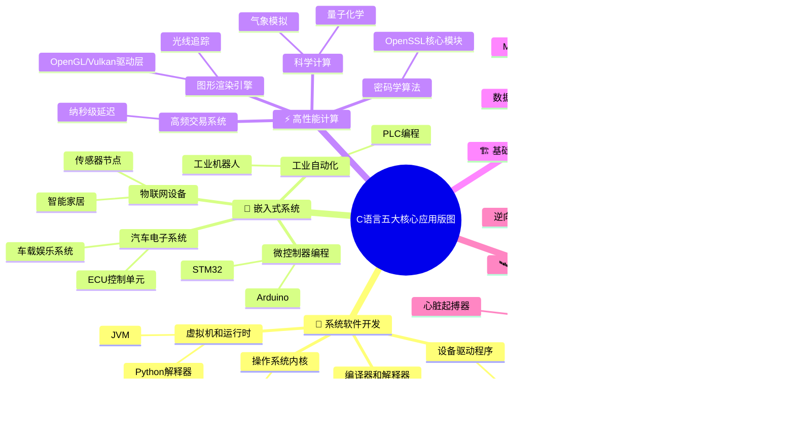

C语言是一种兼具高效性和表达力的通用编程语言。它诞生于20世纪70年代的贝尔实验室，由丹尼斯·里奇（Dennis Ritchie）为开发UNIX操作系统而设计。作为"系统编程语言"的典范，C语言以接近硬件的底层控制能力和优雅的抽象机制著称。它不仅奠定了现代编程语言的基础范式（如指针操作、内存管理），更因其卓越的可移植性，成为连接高级语言抽象与底层硬件效率的桥梁。

## 发展历程

C语言之所以能够成为计算机领域的"通用汇编语言"，与其持续演进的语言标准密不可分。从贝尔实验室的原始设计到ISO国际标准，每一次标准更新都精准回应了当时计算机体系结构变革和软件开发范式的演进需求。理解C语言的发展脉络，将帮助我们更深刻地把握其设计哲学与现代特性：

### 起源（1969-1973年）

- C语言由Dennis Ritchie在贝尔实验室开发。
- 旨在为Unix操作系统提供一种高效的系统编程语言。

### 早期发展（1973-1978年）

- C语言在贝尔实验室内部使用和改进。
- 逐渐成为Unix操作系统的主要开发语言。

### K&R C（1978年）

- 由Dennis Ritchie和Brian Kernighan在《The C Programming Language》一书中定义。
- 成为C语言的事实标准。

### ANSI C（C89/C90）（1989-1990年）

- 美国国家标准协会（ANSI）对C语言进行标准化，形成C89标准。
- 国际标准化组织（ISO）采纳了相同的标准，称为C90。
- 引入了函数原型、`void`指针等新特性。

### C99（1999年）

- ISO发布了C99标准。
- 引入了`long long`类型、布尔类型、可变长度数组、混合声明和语句等新特性。
- 可变长度数组和`inline`关键字的引入，显著提升了科学计算领域的代码效率

### C11（2011年）

- ISO发布了C11标准。
- 引入了线程支持、`_Alignas`关键字、静态断言、`_Noreturn`关键字等新特性。

### C17（2018年）

- ISO发布了C17标准。
- 主要是对C11的修订，移除了一些过时的特性，增强了语言的一致性和稳定性。

### C23（2023年）

- ISO发布了C23标准。
- 引入了新的特性和改进，如`stdatomic.h`的增强、`stdbitman.h`头文件等。

## 核心特性

C语言之所以能在半个世纪的技术浪潮中屹立不倒，关键在于其独特的设计哲学——在硬件控制力与编程抽象性之间找到了精妙的平衡。这种'受控的自由度'使得程序员既能像操作汇编语言般精准管理内存，又能构建高可维护性的复杂系统。以下六大核心特性共同铸就了C语言的持久生命力：

- **贴近硬件的高效性**：通过指针直接操作内存，无运行时环境开销
- **可移植的抽象能力**："写一次，处处编译"的跨平台特性
- **结构化编程范式**：函数模块化设计支持复杂系统开发
- **灵活性与控制力**：兼具高级语言抽象与汇编级硬件控制
- **丰富的生态系统**：标准库覆盖基础功能，第三方库生态完善
- **简洁的语法哲学**：仅32个关键字，强调程序员对系统的完全掌控

## 应用领域

作为**编程语言界的瑞士军刀**，C语言的应用早已突破传统系统编程的边界。其'零抽象成本'的执行效率与'从比特到架构'的全栈控制能力，使其在需要极致性能或深度硬件交互的场景中始终占据统治地位。从火星探测器到智能手表，从金融交易系统到手术机器人，C语言持续驱动着人类技术的底层创新。以下是其五大核心应用版图：

**1. 系统软件开发**

- **操作系统内核**：Linux/Windows内核超过60%代码使用C语言
- **设备驱动程序**：直接操作硬件的特性使其成为驱动开发首选
- **编译器和解释器**：GCC、LLVM等主流编译器均以C/C++实现
- **虚拟机和运行时**：JVM、Python解释器的核心模块大量使用C

**2. 嵌入式系统**

- **微控制器编程**：Arduino、STM32等平台的底层开发语言
- **物联网设备**：资源受限的传感器节点、智能家居设备
- **汽车电子系统**：ECU控制单元、车载信息娱乐系统
- **工业自动化**：PLC编程、工业机器人控制系统

**3. 高性能计算**

- **科学计算**：气象模拟、量子化学计算的底层算法实现
- **图形渲染引擎**：OpenGL/Vulkan驱动层、光线追踪核心逻辑
- **高频交易系统**：纳秒级延迟要求的金融交易系统
- **密码学算法**：OpenSSL等安全库的核心加密模块

**4. 基础设施开发**

- **数据库系统**：MySQL、Redis等主流数据库的存储引擎
- **网络协议栈**：TCP/IP协议实现、路由器交换机固件
- **文件系统**：EXT4/NTFS等文件系统的底层实现

**5. 特殊领域应用**

- **航空航天**：火星探测器Curiosity的飞行软件
- **医疗设备**：MRI扫描仪、心脏起搏器的控制程序
- **逆向工程**：IDA Pro等反编译工具的核心分析模块
- **区块链技术**：比特币节点、以太坊客户端的加密算法

在Rust/Go等新语言冲击下，C语言凭借以下优势保持不可替代性：

1. **历史代码基数**：全球现存约800亿行C代码需要维护
2. **工具链成熟度**：GCC/LLVM对C语言优化已达理论极限水平
3. **标准稳定性**：向后兼容策略保障工业级代码长期可用
