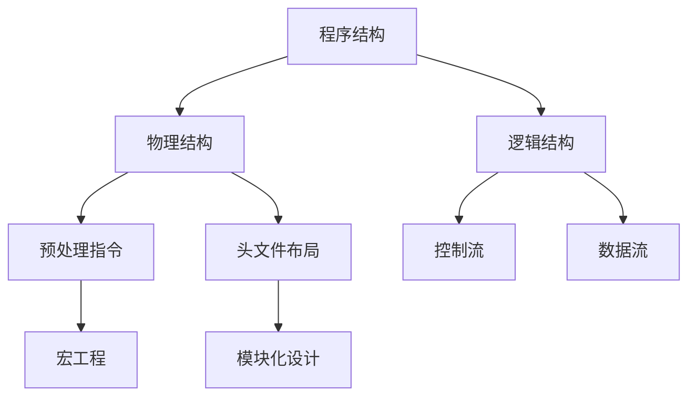
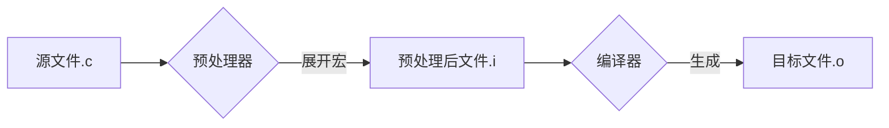

如同建筑需要蓝图，C程序的结构设计决定了其健壮性与可维护性。一个规范的程序结构不仅能让编译器正确解析代码，更能让其他开发者像阅读文章般理解程序逻辑。从UNIX系统内核到Arduino微控制器，所有优秀的C代码都遵循着相似的结构范式。

让我们从经典的"Hello World"程序入手，揭示C语言的结构奥秘：

```c
/* 
 * 第一个C程序：跨越半世纪的问候 
 * 编译命令：gcc -std=c11 -o hello hello.c
 */
#include <stdio.h>  // 包含标准输入输出库

// 程序执行入口
int main(void) 
{
    printf("Hello, World!\n");  // 输出问候语
    return 0;                   // 返回操作系统状态码
}
```

**结构要素详解**  

1. **预处理区（Preprocessor Section）**  
   - `#include`指令引入外部库，如同给程序装载工具包  
   - 类比建筑中的"材料准备阶段"，决定程序的基础能力边界  
   - 技术规范：必须置于文件顶部，每条指令独占一行

2. **主函数（main Function）**  
   - 程序执行的唯一入口点，相当于城市的主干道  
   - C99标准强制声明形式：`int main(void)` 或 `int main(int argc, char *argv[])`  
   - 返回值约定：0表示成功，非0值表示错误类型（可通过`echo $?`查看）

3. **代码区块（Code Block）**  
   - 由花括号`{}`界定的逻辑单元，体现结构化编程思想  
   - 缩进规范：K&R风格（起始括号同行） vs Allman风格（括号独占一行）

下图是C程序结构图谱：



**行业实践案例**  

Linux内核启动代码片段解析：

```c
/* arch/x86/boot/main.c */
void main(void) 
{
    /* 硬件初始化阶段 */
    init_default_io_ops();
    detect_memory();

    /* 进入保护模式 */
    go_to_protected_mode();

    /* 永不返回 */
    for (;;)
        halt();
}
```

通过清晰的区块划分，即使没有注释也能理解执行流程

## 注释的艺术

注释是写给未来的自己和团队的情书。优秀的注释应像GPS导航：在关键路口给出指引，而非逐米播报路况。在NASA的C编码标准中，注释占比要求严格控制在20-30%之间——这是人类短期记忆容量决定的黄金比例。

**注释类型精讲**  

1. **元数据注释（Metadata）**  

   ```c
   /* 
    * 文件：matrix.c 
    * 作者：Linus Torvalds
    * 版本：2.6.32
    * 许可：GPLv2
    */
   ```

   - 作用：记录文件的起源与演化轨迹  
   - 规范：采用兼容Doxygen的格式

2. **警戒注释（Warning）**  

   ```c
   // !!! 临界区开始：此处禁用中断 !!!
   spin_lock_irqsave(&lock, flags);
   ```

   - 使用场景：标记线程不安全代码、未优化算法等

3. **调试注释（Debugging）**  

   ```c
   #if 0
     legacy_code(); // 已废弃的算法实现
   #endif
   ```

   - 技巧：利用预处理指令实现注释的"版本快照"

**反模式警示**

```c
// 错误示例：注释与代码脱节
int count = 0; // 初始化计数器
count++;       // 这里需要减1 ← 危险！
```

**军事级注释规范**

美国国防部C编码标准（MISRA C:2012）要求：  

- 所有`if`语句必须注释执行条件  
- 每个函数必须说明副作用和参数约束  
- 修改历史必须用`// CHG:`标记追踪

## 预处理器指令

在C语言的编译过程中，存在一个神奇的'代码化妆师'——预处理器。它会在编译器正式工作之前，对源代码进行各种'美容手术'：替换文本、插入内容、甚至根据条件删除代码块。就像建筑工地的脚手架，虽然不属于最终建筑结构，却是建造过程中不可或缺的支撑体系。

**编译过程全景**



**深度技术解析**

1. **宏定义的黑魔法**  

   ```c
   #define CASE break;case // 简化switch语法
   switch(c) {
       CASE 'A': do_something();
       CASE 'B': do_another();
   }
   ```

   *注意：此类技巧需团队共识方可使用*

2. **条件编译实战**  

   ```c
   #if defined(__GNUC__) && !defined(__clang__)
   #define GCC_OPTIMIZE _Pragma("O3")
   #elif defined(_MSC_VER)
   #define SECURE _CRT_SECURE_NO_WARNINGS
   #endif
   ```

   *实现跨编译器优化配置*

3. **头文件保护机制演进**  

   - 传统方式：`#ifndef HEADER_H`  
   - 现代实践：`#pragma once`（非标准但被主流编译器支持）  
   - 性能对比：GCC测试显示`#pragma once`减少5-7%编译时间

**工业级应用案例**  

OpenSSL中的平台适配策略：

```c
/* openssl/include/openssl/opensslconf.h */
#if defined(OPENSSL_SYS_WIN32) && !defined(WIN32)
# define WIN32
#endif

#if defined(USE_SSE2) && !defined(__SSE2__)
# undef USE_SSE2 // 自动禁用不支持的指令集
#endif
```

>[!warning] 注意
> "1997年火星探路者号的软件故障，正是由于C代码中缺少必要的`#ifdef`防护指令，导致内存管理模块在特殊情况下崩溃。这个价值3亿美元的经验教训，让NASA从此强制要求所有关键代码必须包含详尽的预处理防护"
